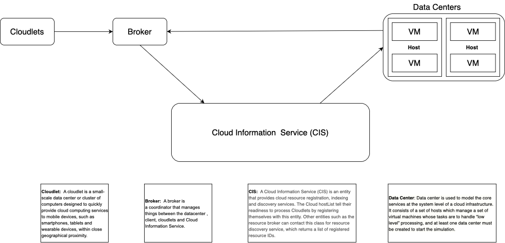
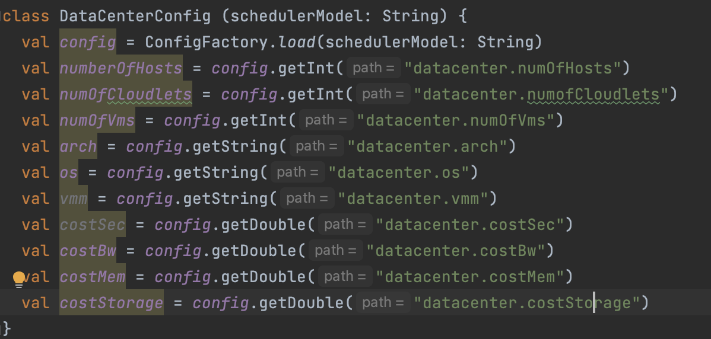
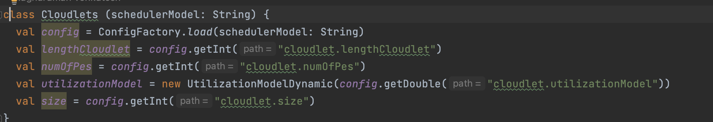
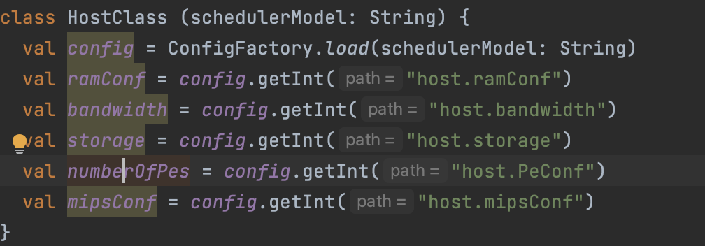
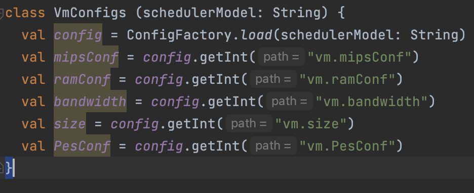

# CloudSimPlusDemo
**Name** : Raghuraman Venkatesh   
**E-mail** : rvenka26@uic.edu

## Project Description:
In this project, we are going to create cloud simulators for evaluating executions of applications in cloud datacenters with different characteristics and deployment models.
We will be using CloudSimPlus to acheive the necessary tasks. CloudSimPlus is a cloud simulation tool that lets users create necessary environment that a cloud computing company faces.   
The  Cloudsimplus involves various aspects like broker, Cloud Information Service, Datacenters, Virtual Machines, Topology, Hosts and Cloudlets.

## CloudSim Plus Components:
#### Cloudlets:
Cloudlet is a small portion of the cloud computing environment.Cloudlet in Cloudsim is a model class that defines the specifications for a simulation engine corresponding to the real-life candidate applications.

#### Broker:
A broker will managing the resources between the cloudlets, Cloud Information Service,and the datacenters. It controls the ppolicy that has to be intiated, the VMs and the hosts.
It will define the way the cloud should be executing according to the user input.

#### Cloud Information Service:
An organization that offers cloud resource registration, indexing, and discovery services is known as a cloud information service (CIS). The Cloud hostList registers with this object to indicate that they are prepared to process Cloudlets. This class offers a resource discovery service that returns a list of registered resource IDs to other entities, such as the resource broker. 
In conclusion, it functions like a yellow pages service. Upon starting the simulation, CloudSim will generate this class. Consequently, there is no need to bother about producing a class object.

#### Datacenter:
A cloud infrastructure's fundamental services are modeled using a data center at the system level. To begin the simulation, at least one data center must be constructed. It consists of a group of hosts that control a group of virtual machines that do "low level" computing.

#### Host:
A Host is a server that is physically placed inside a Datacenter.  It simulated in the cloudsim and various information about the configuration of the host is given as input.

We will take a look into the architecture that we will be simulating in this project.
#### Architecture Diagram


#### Config Files:
The configuration for datacenters, VMs , Hosts and Cloudlets are given in the respective policy and service files.
The file are under resources folder. They are
 - Iaas.conf
 - Paas.conf
 - Saas.conf
 - RoundRobin.conf
 - SpaceShared.conf
 - TimeShared.conf
 
 For the datacenter, the parameters include
 , Number of Hosts
 , Number of Vms
 , Number of Cloudlets
     
     
 For the host, the parameters include
, Ram 
, Bandwidth
, Storage
, Mips
, Processing Entity
 
 
 For the VM, the parameters include
 , Ram 
 , Bandwidth
 , Size
 , Mips
 , Processing Entity
 
 
 For the host, the parameters include
 , Utilization Model
 , Length
 , Processing Entity
 , Size
 
 ## Project Classes:
 The main class is under the name ```Simulation.Scala```.
 The project structure has two different folders:
 - HelperUtils, which contain all the configuration parameters for various polices and services.
 - Policies, which contain all the implementation of the mentioned policies and their structure.
 #### Data Center Configuration:
 
 #### Cloudlet Configuration:
 
 #### Cloudlet Configuration:
 
 #### Virtual Machine Configuration:
 
  
