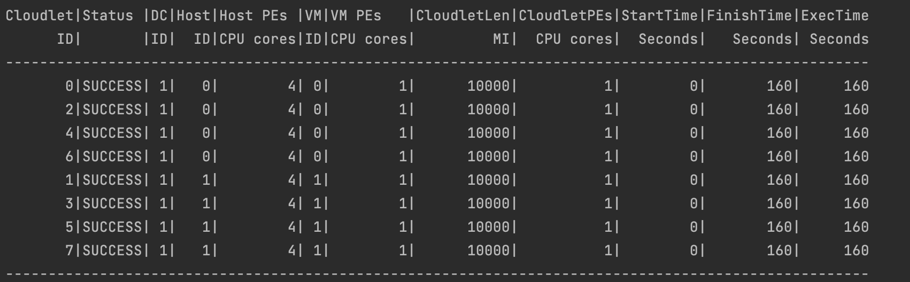
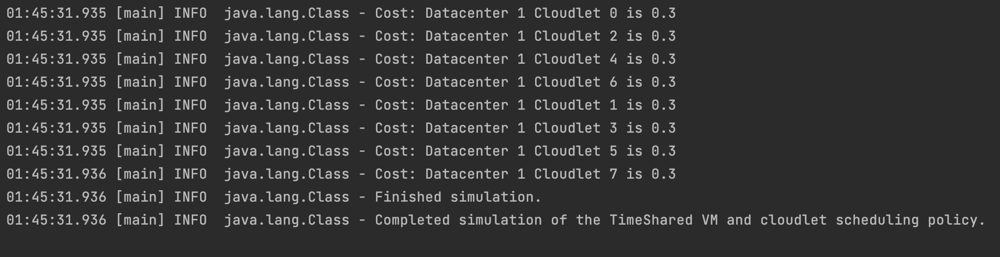
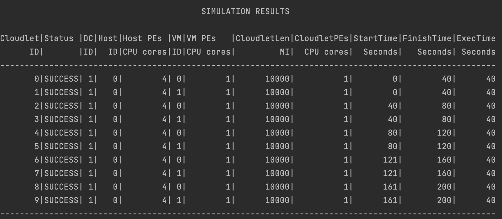
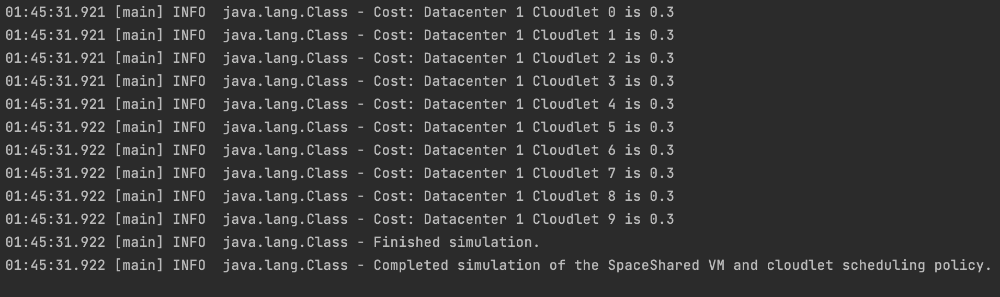
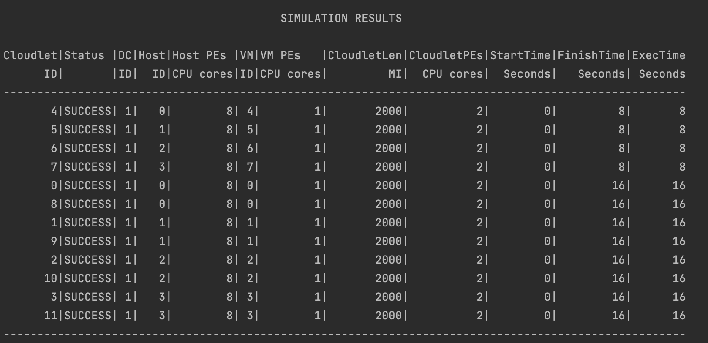
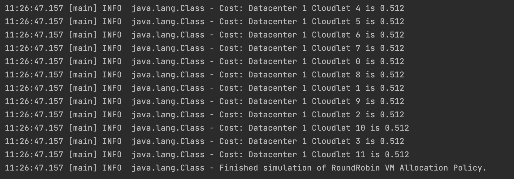
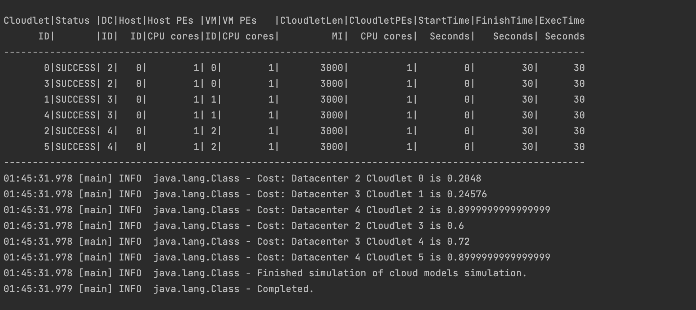

# CloudSimPlusDemo
**Name** : Raghuraman Venkatesh   
**E-mail** : rvenka26@uic.edu

## Project Description:
In this project, we are going to create cloud simulators for evaluating executions of applications in cloud datacenters with different characteristics and deployment models.
We will be using CloudSimPlus to acheive the necessary tasks. CloudSimPlus is a cloud simulation tool that lets users create necessary environment that a cloud computing company faces.   
The  Cloudsimplus involves various aspects like broker, Cloud Information Service, Datacenters, Virtual Machines, Topology, Hosts and Cloudlets.

## CloudSim Plus Components:
#### Cloudlets:
Cloudlet is a small portion of the cloud computing environment.Cloudlet in Cloudsim is a model class that defines the specifications for a simulation engine corresponding to the real-life candidate applications.

#### Broker:
A broker will managing the resources between the cloudlets, Cloud Information Service,and the datacenters. It controls the ppolicy that has to be intiated, the VMs and the hosts.
It will define the way the cloud should be executing according to the user input.

#### Cloud Information Service:
An organization that offers cloud resource registration, indexing, and discovery services is known as a cloud information service (CIS). The Cloud hostList registers with this object to indicate that they are prepared to process Cloudlets. This class offers a resource discovery service that returns a list of registered resource IDs to other entities, such as the resource broker. 
In conclusion, it functions like a yellow pages service. Upon starting the simulation, CloudSim will generate this class. Consequently, there is no need to bother about producing a class object.

#### Datacenter:
A cloud infrastructure's fundamental services are modeled using a data center at the system level. To begin the simulation, at least one data center must be constructed. It consists of a group of hosts that control a group of virtual machines that do "low level" computing.

#### Host:
A Host is a server that is physically placed inside a Datacenter.  It simulated in the cloudsim and various information about the configuration of the host is given as input.

We will take a look into the architecture that we will be simulating in this project.
#### Architecture Diagram


#### Config Files:
The configuration for datacenters, VMs , Hosts and Cloudlets are given in the respective policy and service files.
The file are under resources folder. They are
 - Iaas.conf
 - Paas.conf
 - Saas.conf
 - RoundRobin.conf
 - SpaceShared.conf
 - TimeShared.conf
 
 For the datacenter, the parameters include
 , Number of Hosts
 , Number of Vms
 , Number of Cloudlets
     
     
 For the host, the parameters include
, Ram 
, Bandwidth
, Storage
, Mips
, Processing Entity
 
 
 For the VM, the parameters include
 , Ram 
 , Bandwidth
 , Size
 , Mips
 , Processing Entity
 
 
 For the host, the parameters include
 , Utilization Model
 , Length
 , Processing Entity
 , Size
 
 ## Project Classes:
 The main class is under the name ```Simulation.Scala```.
 The project structure has two different folders:
 - HelperUtils, which contain all the configuration parameters for various polices and services.
 - Policies, which contain all the implementation of the mentioned policies and their structure.
 #### Data Center Configuration:
 
 #### Cloudlet Configuration:
 
 #### Hosts Configuration:
 
 #### Virtual Machine Configuration:
 
 ## CloudModels.Scala:
  This class is used to implement the different services and connect them using a BRITE topology network.
  The different services implemented are :
  #### 1)Software as a Service(Saas):
  The Software as a Service (Saas) is a cloud model that is designed in such a way that the end users will only be able to modify and access application level objects. The infrastructure beyond the application layer is not under the control of the end user, it will be solely controlled by the cloud service provider.
  #### 2)Platform as a Service(Paas):
  The Platform as a service (Paas) is a cloud model that lets the users to develop, deploy, and monitor the application on the cloud platform. The users can control and access the whole application that is deployed on the platform. The VM, OS,and the infrastructure that the application is deployed on is not under the contorl of the user. It will be wholly controlled by the cloud service provider.
  #### 3)Infrastructure as a Service(Iaas):
  The Infrastructure as a Service (Iaas) will let the user to control the whole infrastructure including the virtual machines, OS, network to be implemented. This lets the user to control the performance and the cloud provider will only control and maintain the physical devices that run these infrastructures.
  #### BRITE Topolgy:
  Implements a network layer by reading the topology from a file in the BRITE format, the Boston university Representative Topology gEnerator, and generates a topological network from it. Information of this network is used to simulate latency in network traffic of CloudSim.
  The topology file may contain more nodes than the number of entities in the simulation. It allows users to increase the scale of the simulation without changing the topology file. Nevertheless, each CloudSim entity must be mapped to one (and only one) BRITE node to allow proper work of the network simulation. Each BRITE node can be mapped to only one entity at a time. 
 ## Scheduling.Scala:
 The scheduling class will be used to implement Time Shared and Space shared schedling algorithm.
 #### Time Shared Scheduling :
 In this case, multiple workloads would split the necessary resources (task). Sharing is carried out through time-sliced allocation, where each workload is given access to the necessary resource for a specific period of time. The current job execution is paused and the resource is released once the specified time slice has passed.
 The configuration used for Time shared is given below:    
 - Number of Hosts = 2.  
 - Number of VMs = 2.  
 - Number of Cloudlets = 8.  
 #### Space Shared Scheduling:
 In this, the required resources are assigned solely for the execution of the desired workload and will only be released upon completion. Batch process scheduling is another name for space-sharing.
 The configuration used for space shared is given below:  
- Number of Hosts = 1. 
- Number of VMs = 2. 
- Number of Cloudlets = 10. 
 ## VMAllocation.Scala:
 The VM allocation class will implement the round robin vm allocation policy among the datacenters.
 A circular Round-Robin VM placement policy that selects the next Host with sufficient resources to place a given VM. It then continues on to the next available Host when a new VM has to be placed after choosing a suitable Host. With a best-case complexity of O(1) and a worst-case complexity of O(N), where N is the number of hosts, this strategy has a good time efficiency.
 The configuration used for round robin is given below:
- Number of Hosts = 4. 
- Number of VMs = 8. 
- Number of Cloudlets = 12. 
## Output:
#### Time Shared:
###### Cloudlet Table:       

###### Cost :


#### Space Shared:
###### Cloudlet Table:       

###### Cost :



#### Round Robin:
###### Cloudlet Table:       

###### Cost :



#### Topology:
###### Cloudlet Table:       

